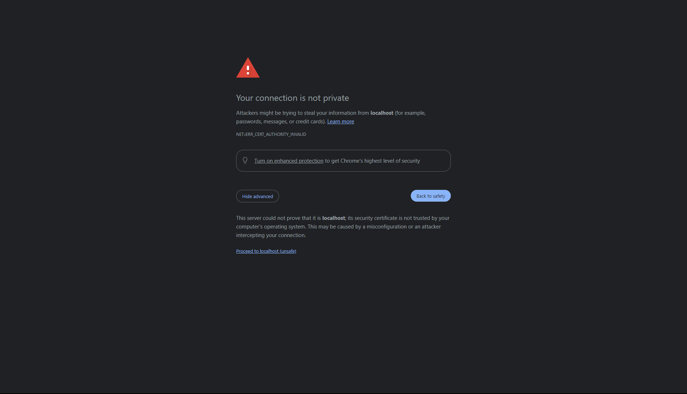
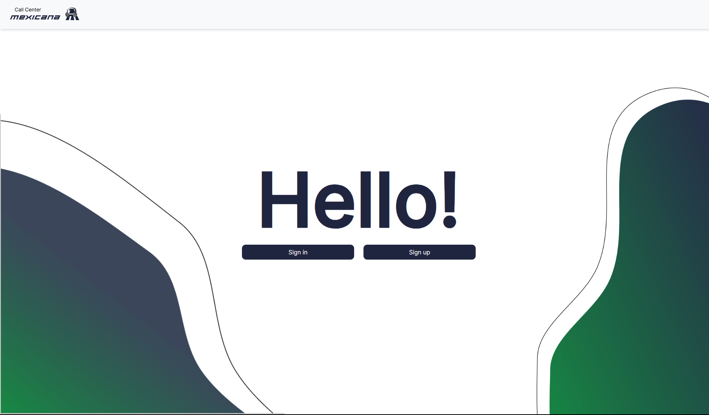

# Installation Manual

## Prerequisites

- [Node.js](https://nodejs.org/)
- [Git](https://git-scm.com/downloads)
- [Amazon Web Services Account](https://aws.amazon.com/es)

## Clone the Repository

To clone the repository, open your preferred Command Line Interface (CLI) and type the following command in the directory where you want to clone the repository:

```sh
git clone https://github.com/sergiozuckermann/Desarrollo_de_software.git
```

After cloning the repository, navigate into the folder:

```sh
cd ..\Desarrollo_de_software\mexicana-callcenter
```

## Environmental Variables.

Create a `.env` file with the Amazon Web Services Identity and Access Management (IAM) Authorized User Access Keys.
    
```sh
ACCESS_KEY_ID = YOUR_ACCESS_KEY_ID
SECRET_ACCESS_KEY = YOUR_SECRET_ACCESS_KEY
```

Go to the root directory of the repository at:
```sh
..\Desarrollo_de_software\mexicana-callcenter
```

### BACKEND.

Go to the root backend directory of the repository at:

```sh
..\Desarrollo_de_software\mexicana-callcenter\backend
```

and drag the `.env` file in. You are done!

### FRONTEND.

Go to the root frontend directory of the repository at:

```sh
..\Desarrollo_de_software\mexicana-callcenter\frontend
```

and drag the `.env` file in. You are done!

## BACKEND.

### Installation of dependencies.

Open your preferred Command Line Interface (CLI) and navigate to the location.

```bash
cd ..\Desarrollo_de_software\mexicana-callcenter\backend
```
In that same location, execute the next command to install the dependencies:

```js
npm install
```
### Running the server

After having installed the dependencies, run the server with the command:

```js
node index.js
```

The next message should be displayed in the Command Line Interface (CLI).

```bash
Server is running at http://localhost:3000
```

## Frontend

### Installation of dependencies.

Open your preferred Command Line Interface (CLI) and navigate to the location.

```bash
cd ..\Desarrollo_de_software\mexicana-callcenter\frontend
```
In that same location, execute the next command to install the dependencies:

```js
npm install
```

Once the installation has finished, run the server with the command:

```sh
npm run dev
```

Something similar to the next message should be displayed in the Command Line Interface (CLI).
Click on either of the two HTTPS links to be redirected to the Call Center Mexicana Web App.

```bash
> mexicana-callcenter@0.0.0 dev
> vite


  VITE v5.2.9  ready in 169 ms

  ➜  Local:   https://localhost:5173/
  ➜  Network: use --host to expose
  ➜  press h + enter to show help
```

When entering the website for first time, the next message will appear. 



1. Click on Advanced.
2. Proceed to localhost(unsafe).
3. Congrats! You are in.




